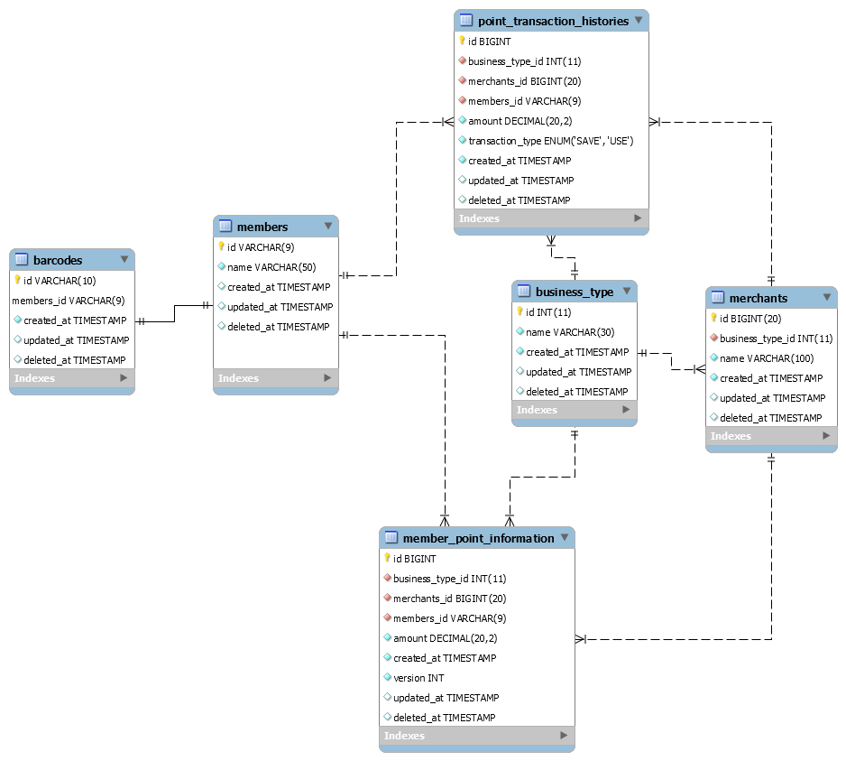

# kakaopay 과제 유형

### 설계내용
- database
  - PK 생성 고민 부분
    - barcode, members 테이블의 기본키는 바코드 번호 (10자리)와 회원 아이디(9자리)로 잡는다
    - 이유: 어차피 해당 값들이 고유한 값으로 사용하기 때문에 굳이 AutoIncrement는 사용하지 않는다
  - point 관리 부분
    - 고유 식별 정책: 가맹점 업종 id + 가맹점 id + 회원 id로 고유값을 식별한다
    - 포인트의 남은 금액을 관리하는 테이블 (member_point_information)과 포인트 내역 관리 테이블(point_transaction_histories) 2개로 관리한다
    - member_point_information은 `동시 데이터 update`를 대비하여 `낙관적 락(version column)`을 사용하였다
    - 포인트 동시 업데이트는 잦지 않은 상황으로 판단하여 낙관적 락 사용
  - 확장성 고려
    - merchants의 업종 확장을 고려하여 업종 테이블(business_type)은 따로 관리한다
    - 해외 화폐 단위를 고려하여 포인트 금액은 bigdecimal 타입으로 진행한다
  - 공통
    - 모든 테이블은 created_at, updated_at, deleted_at이 공통으로 붙어있다.
      - created_at: 데이터 삽입 시간
      - updated_at: 데이터 수정 (수동 보정 포함)
      - deleted_at: 데이터 삭제 (논리적 삭제 진행)
- application
  - 바코드 생성 부분
    - 완전 예측 불가하게 10자리 모두 랜덤하게 생성
    - 겹칠 경우 db 확인 후 재생성 후 최종 리턴 진행 
  - controller layer에서 service 호출이 많아지면 facade 패턴 이용 (aggregation 및 코드 가독성 향상 목적)
  - point 부분은 적립/취소 부분이 일부 부분을 제외한 공통 부분이라 template method 패턴 이용
  - API response 공통 클래스 생성 (성공, 실패 모두 포함)
  - 기간별 내역 조회 API는 페이징 처림 진행 (일반 view에서 사용한다는 가정하에 limit, offset 이용)

### 깃 관리 조건
1. git-flow 정책 사용
2. githook pre-commit을 이용하여 feature 브랜치에 한해서 checkstyle convetion 검사를 진행한다.
3. githook prepare-commit-msg를 이용하여 feature 브랜치에 한해서 커밋 템플릿 메세지를 이용한다.

### 서비스 실행 방법
1. 터미널 프로그램에서 프로젝트 rootDir로 이동하여 `docker-compose up -d`를 입력한다.
2. 최초 실행시 테이블 생성 및 초기 데이터 추가됨

### swagger url
- http://localhost:8080/swagger-ui/index.html

### 사용 db mariadb
- db명: kakaopay
- username: root, password: 1234

### api sample
- resources/http 하위에 http 파일 이용
- swagger sample 이용

### db script
- resources/sql 하위에 sql 파일 이용

### erd

### powered by whahn
# kakaopay
# kakaopay
